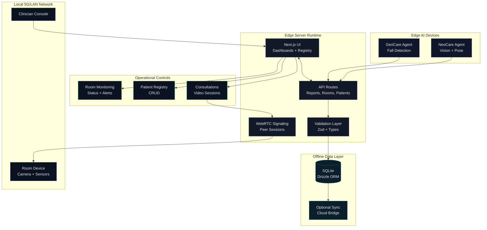

# NexCare-5G Edge Server

NexCare-5G is an offline-first edge healthcare monitoring platform focused on neonatal and geriatric care. It combines real-time monitoring, AI-assisted reporting, and clinician workflows in a single Next.js application.

## Architecture (Standardized)

Layered view:

1. Presentation layer
   - Next.js App Router UI for dashboards, registry, alerts, and operations
2. Application layer
   - API routes for reports, rooms, patients, consultations, and signaling
3. Data layer
   - Drizzle ORM with SQLite for offline-first storage and optional cloud sync
4. Real-time layer
   - WebRTC signaling and peer connections
   - Polling hooks for room status and reports
5. Edge AI layer
   - Python agents (NeoCare and GeriCare) push reports to the API

Data flow:

Edge AI agent -> API reports -> database -> UI dashboards
Clinician -> UI -> API -> database -> dashboards

### Architecture Diagram (Industry Grade)



## Proposed Solution

- Deploy the Edge Server on a local network with offline-first storage.
- Run NeoCare and GeriCare AI agents on edge devices to stream reports.
- Provide clinician dashboards for monitoring, alerts, and consultations.
- Support WebRTC video sessions for clinician-to-room consultations.

## Novelties

- Offline-first edge monitoring with local persistence.
- Dual-domain AI workflow (neonatal and geriatric) under one platform.
- Integrated WebRTC consultations without external cloud dependencies.
- **P2P file transfer with unlimited size using WebRTC data channels** (no server storage, end-to-end encrypted).
- Structured AI reporting pipeline with validation and alerting.

## Present Work

- NeoCare dashboard with registry, alerts, and clinical units
- GeriCare monitoring views and activity tracking
- Room monitoring and diagnostics pages
- Patient registry with CRUD workflows
- WebRTC consultation sessions and signaling
- **WebRTC data channel for unlimited P2P file transfers** (zero server storage)
- API validation with Zod and typed models
- Drizzle ORM schema for core entities

## Quick Start

Prerequisites:
- Node.js 18+
- npm or pnpm

### Local Development (Single Laptop):

```bash
npm install
npx tsx scripts/seed.ts
npm run dev:local
```

App runs at: http://localhost:3000

### Multi-Device Setup (Mobile Hotspot):

**🚀 EASIEST METHOD - Double-click:**  
```
SETUP-NETWORK.bat
```
This automatically detects your IP and configures everything!

**📖 Documentation:**
- **Step-by-Step Guide**: [docs/MOBILE_HOTSPOT_CONNECTION_GUIDE.md](docs/MOBILE_HOTSPOT_CONNECTION_GUIDE.md) ⭐ **START HERE**
- **Quick Reference Card**: [docs/QUICK-REFERENCE.md](docs/QUICK-REFERENCE.md) (Print this!)
- **Network Diagrams**: [docs/NETWORK_TOPOLOGY.md](docs/NETWORK_TOPOLOGY.md)

**Manual Setup:**
```powershell
# 1. Find your IP
ipconfig | findstr IPv4

# 2. Start server
npm run dev

# 3. On other laptops, access at:
http://YOUR-IP:3000  # e.g., http://10.107.51.10:3000
```

**Automated Setup (Mac/Linux):**
```bash
chmod +x setup-hotspot.sh
./setup-hotspot.sh
npm run build
npm start
```

App runs at: http://YOUR-IP:3000 (e.g., http://192.168.43.10:3000)

## WebRTC Multi-Device Setup

### Automated Setup (Recommended):

**On Central Server (Laptop 1):**
```powershell
.\setup-hotspot.ps1
npm start
```

**On AI Agent Laptops (2-3):**
```powershell
cd ai_agents
.\setup-agent.ps1
# Follow prompts to configure
```

**On Browser Laptops (4-5):**
- Open: `http://<SERVER-IP>:3000`
- Login with role-based credentials

### Manual Setup:

1. **Enable Mobile Hotspot**: SSID: `NEXCARE-5G`, Password: `nexcare2026`
2. **Connect all laptops** to the same hotspot
3. **Find Server IP**: Run `ipconfig | findstr IPv4` on server laptop
4. **Configure .env.local**: Set `NEXT_PUBLIC_SIGNALING_SERVER_URL=http://<IP>:3000`
5. **Start Server**: `npm start` (listens on 0.0.0.0:3000)
6. **Start Consultation**: Doctor clicks "Start Consultation"
7. **Join from Room**: Open `/room-call/<sessionId>` on room monitor laptop

**Detailed Instructions**: See [docs/MOBILE_HOTSPOT_SETUP.md](docs/MOBILE_HOTSPOT_SETUP.md)

## Key Routes

- /neocare
- /gericare
- /room-monitoring
- /patients
- /consultations
- /analytics
- /diagnostics

## Project Structure

```
app/                UI and API routes
components/         Reusable UI components
drizzle/            Database schema
hooks/              Client hooks
lib/                Data, validation, and WebRTC utilities
ai_agents/          Python edge AI agents
scripts/            Seeds and utilities
```

## Notes

- The system is designed for local networks and offline operation.
- AI agents are optional for UI exploration; mock data is available in some pages.

## License

Proprietary. All rights reserved.
